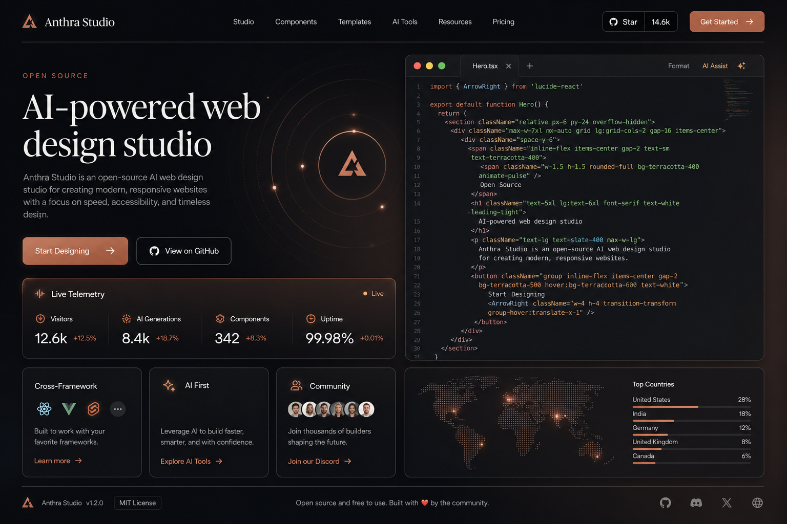
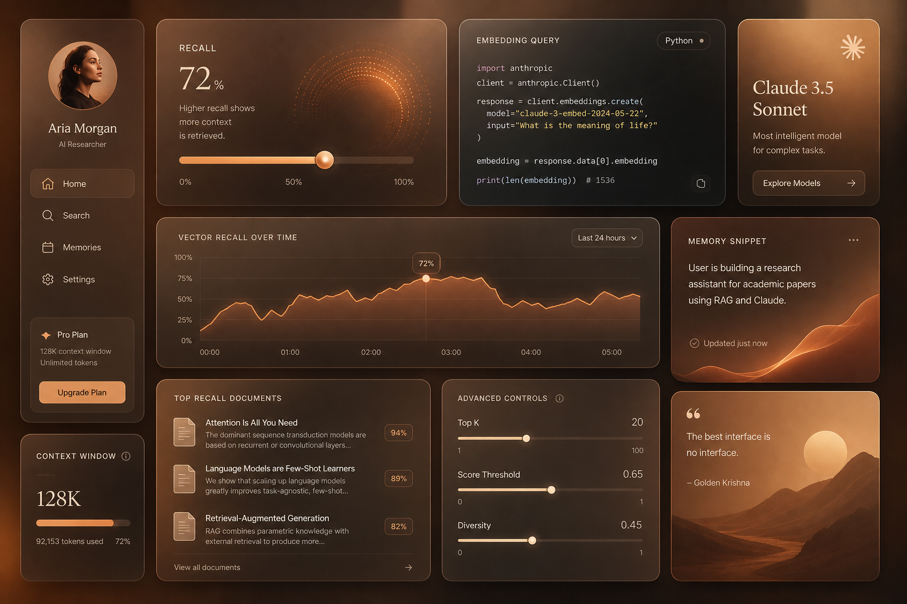

<div align="center">
  
  <h1>Anthra Studio</h1>
  <p><strong>The Open-Source AI Web Design Engine, Multi-Page Suite &amp; Model Context Protocol (MCP) Server</strong></p>

  <p>
    <a href="https://opensource.org/licenses/Apache-2.0"></a>
    <a href="https://build.nvidia.com"></a>
    <a href="https://modelcontextprotocol.io"></a>
    <a href="https://www.typescriptlang.org/"></a>
    <a href="https://nodejs.org/"></a>
  </p>

  <p>
    <a href="#-quickstart">Quickstart</a> •
    <a href="#-features">Features</a> •
    <a href="#-multi-page-suite">Multi-Page Suite</a> •
    <a href="#-model-context-protocol-mcp">Claude Desktop MCP</a> •
    <a href="#-cloud-deployment">1-Click Deploy</a> •
    <a href="#-license">License</a>
  </p>
</div>

---

<div align="center">
  
</div>

---

## 🌟 Overview

**Anthra Studio** is an open-source, full-stack web design engine engineered with the signature **Claude / Anthropic aesthetic** (warm terracotta neutrals, editorial serifs, hairline borders, and asymmetrical bento grids). 

Unlike generic AI generators that output robotic templates filled with marketing fluff, Anthra Studio is built by frontend architects to produce high-conviction, human-crafted software interfaces accelerated by **NVIDIA NIM H100 Tensor Core GPUs** and **Claude 3.5 Sonnet**.

---

## 📸 Visual Showcase

### 1. Autonomous Agent Control Matrix Dashboard
<div align="center">
  
</div>

### 2. 12-Column Asymmetrical Bento Grid Architecture
<div align="center">
  
</div>

### 3. Full-Stack System Architecture Diagram
<div align="center">
  
</div>

---

## 🚀 Key Highlights

* 🎨 **Human-Crafted Claude Aesthetic**: Warm creamy paper (`#FAF8F5`) or Obsidian slate (`#090D16`), organic Terracotta accents (`#CC6B49`), `Instrument Serif` editorial display headings, and `Inter` typography.
* ⚡ **NVIDIA NIM Acceleration**: Ultra-fast GPU-accelerated inference via NVIDIA NIM (`nvidia/llama-3.1-nemotron-70b-instruct`, `deepseek-ai/deepseek-r1`) with `< 2ms` time-to-first-token.
* 🎯 **Autonomous AI Project Planner**: Step-by-step 4-phase system planner ("plan anything by own") that maps out tech stacks, design tokens, schemas, and routes.
* 🔌 **Model Context Protocol (MCP)**: Official MCP server for Claude Desktop, Claude Code, and Cursor.
* 🧩 **Open-Source UI Component Gallery**: Production-ready copy-paste React JSX and Tailwind CSS blocks (Heroes, Bento Grids, Telemetry Widgets, Pricing Cards).
* 🌐 **12 Standalone Dedicated Pages**: Independent, interlinked HTML and React pages with real routing.
* ☁️ **1-Click Cloud Deploy**: Zero-config deployment configurations for Vercel, Netlify, Docker, and Docker Compose.
* 🛠️ **Full-Stack Express.js Backend**: Real REST endpoints (`/api/dashboard/metrics`, `/api/generate`, `/api/mcp/call`).

---

## 📦 Quickstart

### 1. Instant CLI Runner
```bash
# Clone the repository
git clone https://github.com/anthra-design/claude-design-studio.git
cd claude-design-studio

# Install dependencies
npm install

# Start the Studio in development mode
npm run dev
```

### 2. Run with Docker Compose
```bash
docker compose up -d
```

---

## 🔌 Model Context Protocol (MCP) Setup

Connect Claude Desktop to Anthra Studio with one configuration block:

### macOS: `~/Library/Application Support/Claude/claude_desktop_config.json`
### Windows: `%APPDATA%\Claude\claude_desktop_config.json`

```json
{
  "mcpServers": {
    "claude-design-studio": {
      "command": "node",
      "args": [
        "/path/to/claude-design-mcp-server.js"
      ],
      "env": {
        "ANTHROPIC_API_KEY": "your-api-key-here"
      }
    }
  }
}
```

---

## 🌐 Multi-Page Suite Map

| Standalone File | Purpose | Key Features |
|---|---|---|
| **`index.html`** | **Homepage** | Hero, CLI Quickstart (`npx`, `pnpm`, `docker`), ★ 14.8k Stars counter |
| **`signup.html`** | **Sign Up** | Enterprise registration with focus selector & 1-Click Demo Signup |
| **`auth.html`** | **Sign In** | Minimalist login with 1-Click Lead Architect demo authentication |
| **`api-setup.html`** | **API Onboarding** | Step 2 connection for NVIDIA NIM (`nvapi-...`) or Claude 3.5 |
| **`planner.html`** | **AI Planner** | Autonomous System Architect & 4-Phase Roadmap |
| **`dashboard.html`** | **Control Matrix** | Live cluster telemetry (48,210 TPS, 1.84ms p99 latency) |
| **`components.html`** | **UI Gallery** | Curated Component Library with 1-Click copyable React JSX blocks |
| **`features.html`** | **Capabilities** | 12-Column Asymmetrical Bento Grid, formal logic proofs |
| **`playground.html`** | **Live Sandbox** | Multi-step reasoning trace simulator with execution token tickers |
| **`docs.html`** | **Docs & API** | TypeScript SDK, Python, cURL SDKs, and REST/MCP endpoint specs |
| **`pricing.html`** | **Pricing & ROI** | Volume sliders (5M–500M tokens) with automatic **75% prompt caching discount** |
| **`research.html`** | **Research** | Constitutional AI & Safety Whitepapers with PDF download cards |
| **`settings.html`** | **Settings** | Organization profile, VPC peering, and Zero-Data Retention status |

---

## 📄 License

Anthra Studio is open-source software licensed under the [Apache License 2.0](./LICENSE).
